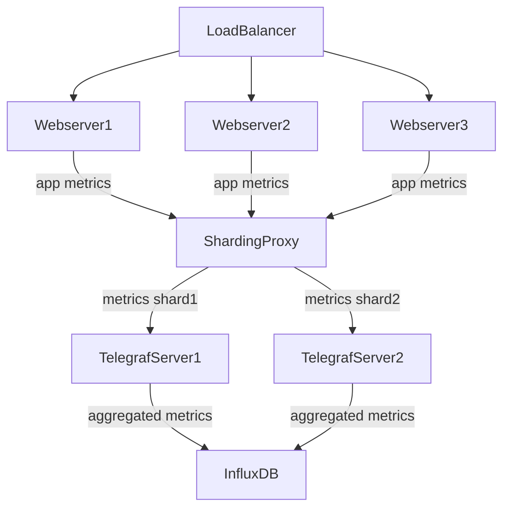

# Rust Sharding StatsD Proxy

This is a toy project to help me learn Rust.

The idea for it came from a previous job. Our StatsD server wasn't able to keep up with the volume of metrics coming from servers and containers. Our pipeline was StatsD metrics to Telegraf (configured with the StatsD input), stored in InfluxDB. I figured the main bottleneck was the aggregation phase that occurs before Telegraf stores metrics in InfluxDB, but I wasn't able to do any experiments to support this hunch. So I thought about creating a StatsD proxy that would consistently shard metrics to 1 of N StatsD servers.



# Current Features

* Hardcoded shard configuration
    * Number of shards
    * IP addresses of downstream Telegraf+StatsD servers
* Receives StatsD messages, 1 or more per UDP packet
* Shards the metric+tags string to one of N downstream servers as UDP

# Future Work

* Configuration via file and commandline flags
* Queue incoming StatsD packets, and use a processing thread to take advantage of multiple CPU cores
* Batch outgoing StatsD metrics up to max UDP packet size to reduce number of UDP packets

# Running it

## Configure and run the proxy

Open `src/main.rs`. Change the `destinations` vector to match the addresses and ports of your destination StatsD servers.

Now, install Rust, and use `cargo run` in the root of the repository.

Use Control+C to quit.

## Generate mock StatsD metrics

Open `helpers/statsd.py` script, then change `PROXY_IP` to the address of the server where you plan to run the proxy.

Run the generator:

```
$ python3 statsd.py
```

Use Control+C to quit.

# Performance anecdotes

Original single-threaded version could process around 1.3-1.6 million messages per 10 seconds.

Two-thread version with channels could process around that much as well. But the problem with channels is they support multiple producers not multiple consumers. And we need more threads processing and sharding the messages that arrive.

In order to have multiple processing/sharding threads, I switched to using a Mutex and Arc around a Vec<String>. With 2 threads it was able to process 2.3 million, and three threads could process 3.3 million. So a definite improvement. And memory no longer grows like it did when using channels. Maybe I didn't configure the channel correctly.

At this point it's possible I'm saturating my loopback, or some other system setting. But I'm pleased to have experimented through the improvements.
