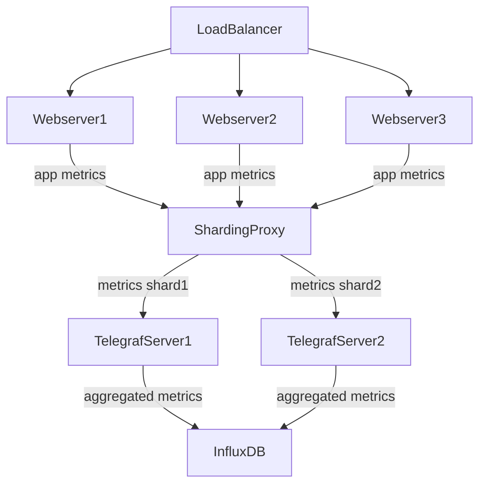

# Rust Sharding StatsD Proxy

This is a toy project to help me learn Rust.

The idea for it came from a previous job. Our StatsD server wasn't able to keep up with the volume of metrics coming from servers and containers. Our pipeline was StatsD metrics to Telegraf (configured with the StatsD input), stored in InfluxDB. I figured the main bottleneck was the aggregation phase that occurs before Telegraf stores metrics in InfluxDB, but I wasn't able to do any experiments to support this hunch. So I thought about creating a StatsD proxy that would consistently shard metrics to 1 of N StatsD servers.



# Current Features

* Configured using INI file
    * Bind interface and port
	* Number of processing threads (set this to according to your CPU cores)
    * IP addresses of downstream Telegraf+StatsD servers
* Receives StatsD messages, 1 or more per UDP packet
* Queues incoming StatsD packets, and uses processing threads to shard and send metrics to one of N downstream servers
* Shard messages using djb2 hash algorithm with bitwise operations

# Future Work

* Configuration via commandline flags
* Batch outgoing StatsD metrics up to max UDP packet size to reduce number of UDP packets

# Running it

## Configure and run the proxy

Open `config.ini` in your editor.

Set `bind_interface` and `bind_port` to the network interface and port you want to proxy to listen for StatsD messages on. 8125 is the common port for StatsD messages.

Set `threads` to the number of CPU cores you want to use for processing. Each thread reads from the queue of messages, shards each message to determine which of N destination servers to send to, and then sends the message to the selected downstream StatsD server.

Set `destinations` to the IP and PORT of one or more downstream StatsD servers, separated by whitespace. See the existing list of destinations as a guide. The proxy will shard and send messages to these servers.

Now, install Rust, and use `cargo run` to run the proxy.

Stop the server by pressing Control+C on your keyboard.

## Generate mock StatsD metrics

Open `helpers/statsd.py` script, then change `PROXY_IP` to the address of the server where you plan to run the proxy.

Run the generator:

```
$ python3 statsd.py
```

Use Control+C to quit.

# Performance anecdotes

Original single-threaded version could process around 1.3-1.6 million messages per 10 seconds.

Two-thread version with channels could process around that much as well. But the problem with channels is they support multiple producers not multiple consumers. And we need more threads processing and sharding the messages that arrive.

In order to have multiple processing/sharding threads, I switched to using a Mutex and Arc around a Vec<String>. With 2 threads it was able to process 2.2 million, and three threads could process 2.4 million. So a definite improvement.

I thought about sharding solely based on binary data, but since a StatsD message might have UTF8 characters (I'm guessing that's valid), it's better to leave in the conversion to UTF8. That way, when I split on comma/colon separators it all works correctly.

